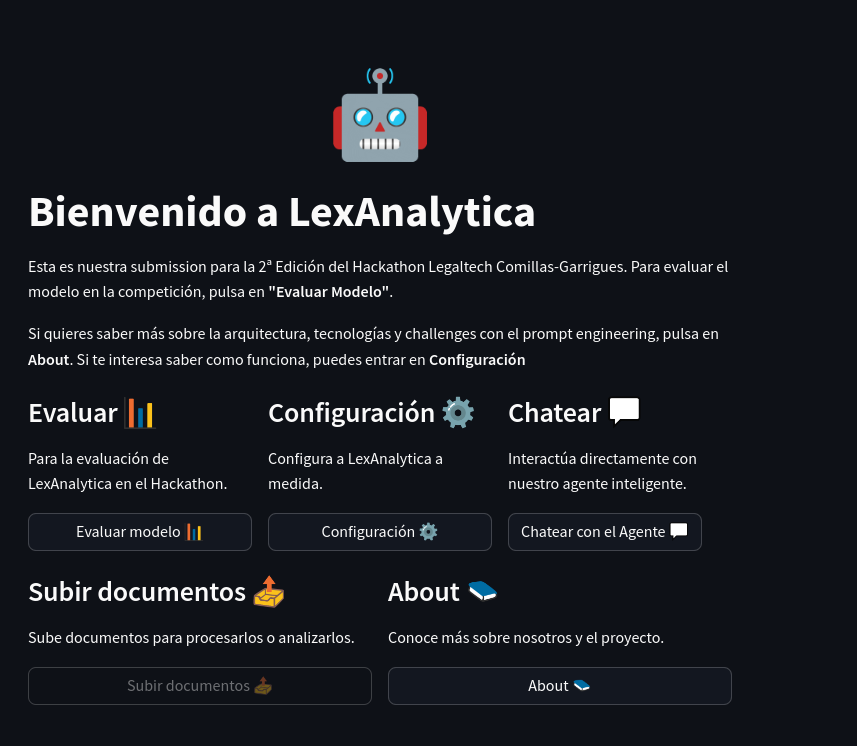
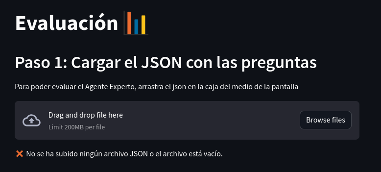
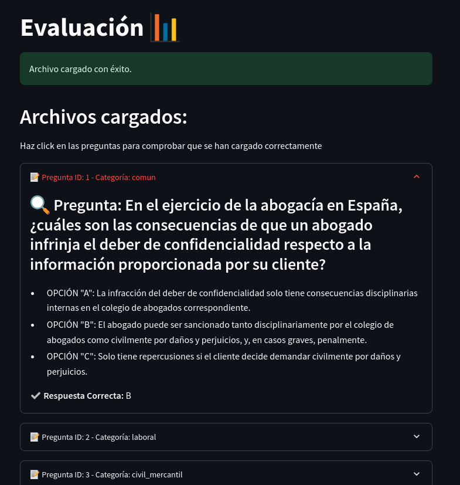
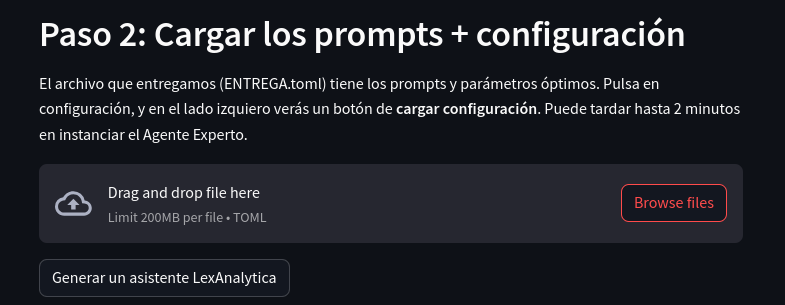
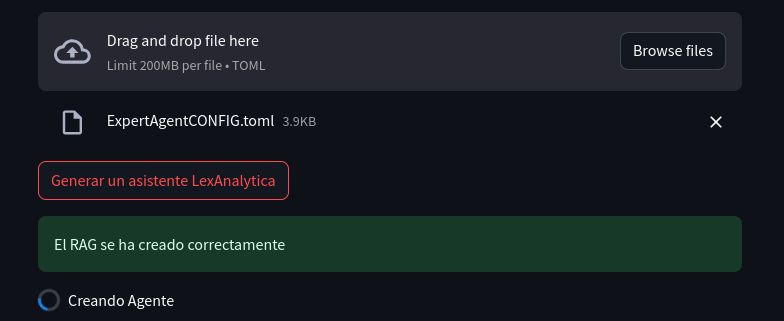
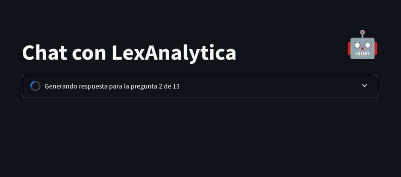
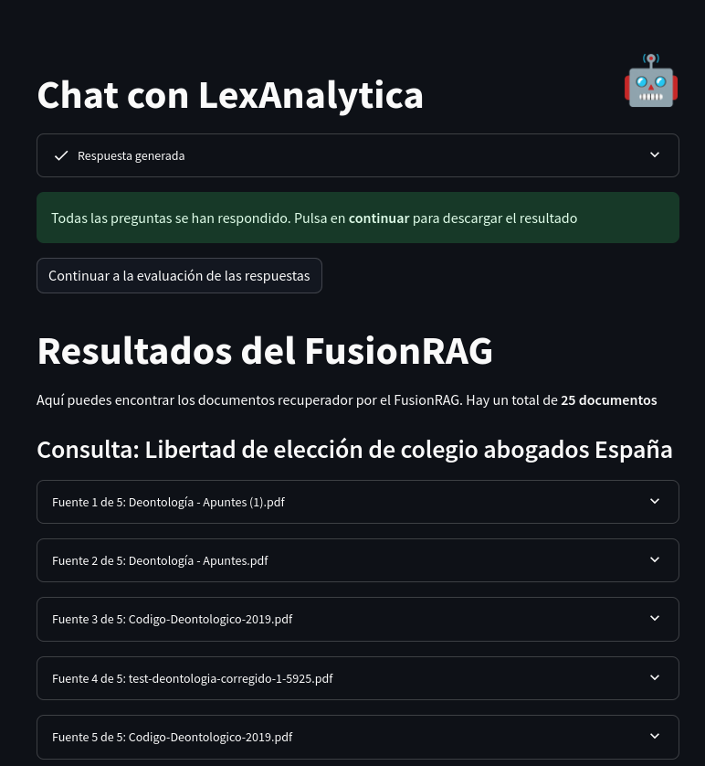
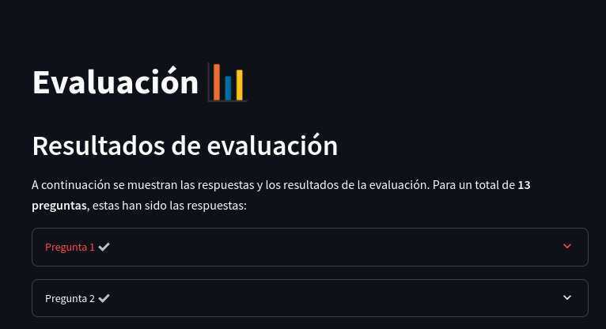

# Instrucciones

## Como ejecutar el código

Para acceder a LexAnalytica, puedes entrar en la página web del MVP: [_LexAnalytica_](legaltech-expertagent.streamlit.app)

Cuando se te pida una contraseña, introduce:
```plain
AgenteHackathonExperto
```

En el menú de inicio, encontrarás varias secciones.


Para evaluar a LexAnalytica, pulsa en "Evaluar". Apartados como "Configuración" o "Chatear" se usan para el desarrollo y testeo, o por si quieres configurar a medida LexAnalytica.

El apartado "About" explica más sobre la tecnología empleada, arquitecturas, TechStack y mejoras a hacer (Que son bastantes).

## Evaluando a LexAnalytica
### Paso 1: Cargar JSON con las preguntas
Cuando hayas hecho click en "Evaluar" te llevará al primer paso, subir la batería de preguntas.


Aquí debes de subir el JSON con la batería de preguntas, con formato:

```json
{
    "preguntas": [
        {
            "id": "ejemplo",
            "categoria": "ejemplo",
            "pregunta": "Pregunta ejemplo",
            "opciones": [
                {
                    "opcion": "A",
                    "texto": "Opción A ejemplo"
                },
                {
                    "opcion": "B",
                    "texto": "Opción B ejemplo"
                },
                {
                    "opcion": "C",
                    "texto": "Opción C ejemplo"
                }
            ],
            "respuesta_correcta": "A"
        }
    ]
}

```

Una vez cargados, la página se actualizará con las preguntas, donde puedes comprobar si se han cargado correctamente.


### Paso 2: Cargar los prompts + configuración

Si están todas correctamente cargadas, desliza abajo hasta llegar al **Paso 2**, donde puedes cargar los prompts y la configuración de LexAnalytica. El archivo ENTREGA.toml contiene parámetros como la temperatura (Para hacer determinista a nuestra IA), las ramas de conocimiento o el número VectorK.


Cuando los hayas cargado, se crearán instancias del FusionRAG y del Agente LexAnalytica. Debido a que se corren comprobaciones, y al haberlo desarrollado con un presupuesto de 6€, la latencia de instanciar el Agente será se ~1.5 minutos.


Cuando se genere, saldrá un pequeño aviso de que se cambia de página, y aparecerá:


Cuando genere las ramas de conocimiento, las mostrará en pantalla. Se van añadiendo todas, podría haber cambiado el comportamiento de esto pero no he tenido tiempo. Con hacer click lo contraes (es un desplegable). Las ramas de conocimiento se ven tal que:


Si se inserta la batería de 50 preguntas, recomiendo encarecidamente que te vayas a dar un paseo, verte un capítulo de nextflix o corregir otros modelos. Debido a nuestro _amplio budget_ no he podido paralelizar las consultas (Lanzar 10 o 15 a la vez) ya que este este servidor dispone de la increible cifra de 800MB de RAM. Más o menos, **tarda de 1 a 2 minutos por pregunta**. Finalmente, os saldrá:


Los **Resultados del FusionRAG** sólo salen para la última pregunta (Ya que sino se me llenaba la memoria). Pero es un poco para que podais ver los trozos de los documentos que recupera. Podría ser bastante mejor si mejorase el RRF, finetunease el embeddings, y otras cosas. Pero lo hace suficientemente bien. También una Vector Store (Donde guardo los embeddings de los documentos) ayudaría mucho a no mezclar documentos de diferentes categorías. Dale a **Continuar a la evaluación de las respuestas**.

Si haces click en cualquiera de las preguntas, se abrirá un deslegable con la pregunta, respuesta, y si se ha acertado o no. También está en el desplegable, el emoji de "✅" o "❌".

Abajo del todo, encontrarás el botón **Descargar respuestas**, para descargarte el JSON de respuesta con formato:
```json
[
    {
        "pregunta": "Pregunta pasada a LexAnalytica",
        "respuesta": "B",
        "justificacion": "Justificación de porque se ha escogido la respuesta correcta, y porqué el resto son incorrectas."
    },
]
```

# Troubleshooting
Si hay algún error, podeis enviarme un correo a darru2002@gmail.com, WhatsApp al +44 07596409710.

El repositorio os lo hemos adjuntado en el mail, pero en caso de necesitar verlo en GitHub, pideme acceso a mi cuenta [de GitHub](https://github.com/paydos)
