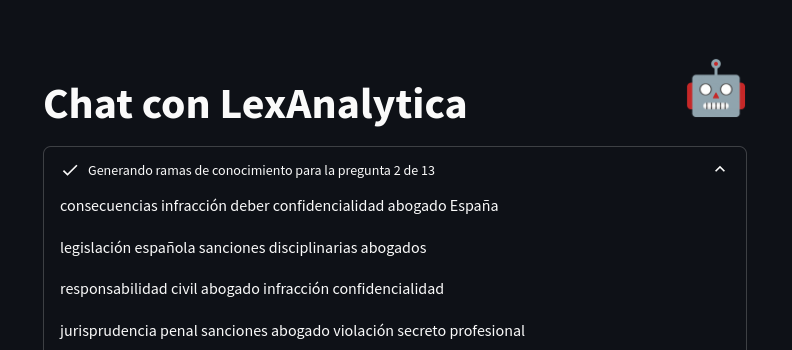

# Instrucciones

## Como ejecutar el código

Para acceder a LexAnalytica, puedes entrar en la página web del MVP: [_LexAnalytica_](http://legaltech-expertagent.streamlit.app)

En el menú de inicio, encontrarás varias secciones.


Para evaluar a LexAnalytica, pulsa en "Evaluar". Apartados como "Configuración" o "Chatear" se usan para el desarrollo y testeo, o por si quieres configurar a medida LexAnalytica.

El apartado "About" explica más sobre la tecnología empleada, arquitecturas, TechStack y mejoras a hacer (Que son bastantes).

## Evaluando a LexAnalytica
### Paso 1: Cargar JSON con las preguntas
Cuando hayas hecho click en "Evaluar" te llevará al primer paso, subir la batería de preguntas.


Aquí debes de subir el JSON con la batería de preguntas, con formato:

```json
{
    "preguntas": [
        {
            "id": "ejemplo",
            "categoria": "ejemplo",
            "pregunta": "Pregunta ejemplo",
            "opciones": [
                {
                    "opcion": "A",
                    "texto": "Opción A ejemplo"
                },
                {
                    "opcion": "B",
                    "texto": "Opción B ejemplo"
                },
                {
                    "opcion": "C",
                    "texto": "Opción C ejemplo"
                }
            ],
            "respuesta_correcta": "A"
        }
    ]
}

```

Una vez cargados, la página se actualizará con las preguntas, donde puedes comprobar si se han cargado correctamente.


### Paso 2: Cargar los prompts + configuración

Si están todas correctamente cargadas, desliza abajo hasta llegar al **Paso 2**, donde puedes cargar los prompts y la configuración de LexAnalytica. El archivo ENTREGA.toml contiene parámetros como la temperatura (Para hacer determinista a nuestra IA), las ramas de conocimiento o el número VectorK.


Cuando se genere, saldrá un pequeño aviso de que se cambia de página, y aparecerá:


Cuando genere las ramas de conocimiento, las mostrará en pantalla. Con hacer click lo contraes (es un desplegable). Las ramas de conocimiento se ven tal que:


Finalmente, os saldrá:


Si haces click en cualquiera de las preguntas, se abrirá un deslegable con la pregunta, respuesta, y si se ha acertado o no. También está en el desplegable, el emoji de "✅" o "❌".

Abajo del todo, encontrarás el botón **Descargar respuestas**, para descargarte el JSON de respuesta con formato:
```json
[
    {
        "pregunta": "Pregunta pasada a LexAnalytica",
        "respuesta": "B",
        "justificacion": "Justificación de porque se ha escogido la respuesta correcta, y porqué el resto son incorrectas."
    },
]
```